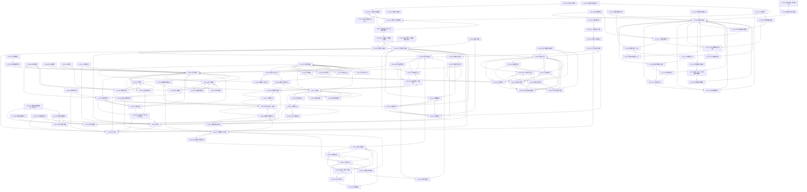

# 初始导航关系

静态 literal 边包含条件、返回和跨页操作；动态拼接导航需另外核对。

```mermaid
flowchart TD
  m01_p01["m01-p01 独家童话"]
  m01_p02["m01-p02 欢迎回来"]
  m01_p03["m01-p03 写下你的名字"]
  m01_p04["m01-p04 找回你的钥匙"]
  m01_p05["m01-p05 换一把新钥匙"]
  m01_p06["m01-p06 独家童话你的故事，独一无二"]
  m01_p07["m01-p07 信已经送出啦"]
  m01_p08["m01-p08 新钥匙准备好了"]
  m02_p01["m02-p01 一起写我们的故事"]
  m02_p02["m02-p02 把这张邀请函交给 TA"]
  m02_p03["m02-p03 收到一封特别邀请"]
  m02_p04["m02-p04 确认和 阿舟 一起写故事吗？"]
  m02_p05["m02-p05 从今天起，故事有了我们"]
  m02_p06["m02-p06 我们的小资料"]
  m02_p07["m02-p07 邀请已经出发"]
  m02_p08["m02-p08 这张邀请函失效了"]
  m02_p09["m02-p09 你已经有一起写故事的人啦"]
  m03_p01["m03-p01 今天也在写童话"]
  m03_p02["m03-p02 今天也在写童话"]
  m03_p03["m03-p03 搜索共同记录"]
  m03_p04["m03-p04 搜索共同记录"]
  m03_p05["m03-p05 写日记"]
  m03_p06["m03-p06 日记"]
  m03_p07["m03-p07 雨后的那封信"]
  m03_p08["m03-p08 今天因为一件小事笑了好久"]
  m03_p09["m03-p09 照片相册"]
  m03_p10["m03-p10 照片相册"]
  m03_p11["m03-p11 添加照片"]
  m03_p12["m03-p12 晚霞散步"]
  m04_p01["m04-p01 重要时刻"]
  m04_p02["m04-p02 重要时刻"]
  m04_p03["m04-p03 重要时刻"]
  m04_p04["m04-p04 新建重要时刻"]
  m04_p05["m04-p05 共同提醒"]
  m04_p06["m04-p06 共同提醒"]
  m04_p07["m04-p07 纪念日"]
  m04_p08["m04-p08 纪念日"]
  m04_p09["m04-p09 添加纪念日"]
  m04_p10["m04-p10 相识纪念日"]
  m04_p11["m04-p11 相识纪念日"]
  m04_p12["m04-p12 时光胶囊"]
  m04_p13["m04-p13 新建时光胶囊"]
  m04_p14["m04-p14 时光胶囊"]
  m04_p15["m04-p15 时光胶囊"]
  m04_p16["m04-p16 悄悄留言"]
  m04_p17["m04-p17 悄悄留言"]
  m05_p01["m05-p01 童话工坊"]
  m05_p02["m05-p02 挑一段我们的回忆"]
  m05_p03["m05-p03 回忆转漫画"]
  m05_p04["m05-p04 照片转漫画"]
  m05_p05["m05-p05 回忆影片"]
  m05_p06["m05-p06 回忆正在变成童话"]
  m05_p07["m05-p07 这次魔法没有成功"]
  m05_p08["m05-p08 海边的那天"]
  m05_p09["m05-p09 我的创作"]
  m05_p10["m05-p10 我们的主角设定"]
  m06_p01["m06-p01 我的与设置"]
  m06_p02["m06-p02 编辑个人资料"]
  m06_p03["m06-p03 我们的小世界"]
  m06_p04["m06-p04 草稿箱"]
  m06_p05["m06-p05 标签管理"]
  m06_p06["m06-p06 童话会员"]
  m06_p07["m06-p07 设置"]
  m06_p08["m06-p08 账号与安全"]
  m06_p09["m06-p09 隐私与共同可见"]
  m06_p10["m06-p10 通知设置"]
  m06_p11["m06-p11 数据与存储"]
  m06_p12["m06-p12 帮助与关于"]
  m07_p01["m07-p01 等待 TA 的确认"]
  m07_p02["m07-p02 一起领养小伙伴"]
  m07_p03["m07-p03 糯米的小屋"]
  m07_p04["m07-p04 我们的宠物"]
  m07_p05["m07-p05 糯米玩得好开心！"]
  m07_p06["m07-p06 和糯米玩一会儿"]
  m07_p07["m07-p07 和糯米互动"]
  m07_p08["m07-p08 给糯米喂点好吃的"]
  m07_p09["m07-p09 给糯米喂食"]
  m07_p10["m07-p10 一起完成啦！"]
  m07_p11["m07-p11 一起照顾糯米"]
  m07_p12["m07-p12 给糯米换新装"]
  m07_p13["m07-p13 给糯米换装"]
  m07_p14["m07-p14 小屋布置完成"]
  m07_p15["m07-p15 一起布置糯米的小屋"]
  m07_p16["m07-p16 布置糯米的小屋"]
  m07_p17["m07-p17 糯米的成长故事"]
  m07_p18["m07-p18 糯米的成长故事"]
  m07_p19["m07-p19 第 27 天 · 今天也被好好照顾"]
  m07_p20["m07-p20 我们的宠物成就"]
  m07_p21["m07-p21 我们和糯米的成就"]
  m07_p22["m07-p22 糯米的收藏图鉴"]
  m07_p23["m07-p23 小花围巾"]
  m07_p24["m07-p24 在告别前，再确认一次"]
  m07_p25["m07-p25 糯米的小屋设置"]
  m08_p01["m08-p01 共同回忆册"]
  m08_p02["m08-p02 共同回忆册"]
  m08_p03["m08-p03 本月回忆推荐"]
  m08_p04["m08-p04 新建回忆册"]
  m08_p05["m08-p05 为这本书挑一件外衣"]
  m08_p06["m08-p06 选择共同素材"]
  m08_p07["m08-p07 素材预览"]
  m08_p08["m08-p08 为回忆选一页版式"]
  m08_p09["m08-p09 编排日记摘录页"]
  m08_p10["m08-p10 编排照片故事页"]
  m08_p11["m08-p11 编排重要时刻页"]
  m08_p12["m08-p12 作品与宠物成长"]
  m08_p13["m08-p13 整理章节与页序"]
  m08_p14["m08-p14 这本回忆书完成啦"]
  m08_p15["m08-p15 我们的夏天"]
  m08_p16["m08-p16 独家童话"]
  m08_p17["m08-p17 阅读工具"]
  m08_p18["m08-p18 为这一页加一张补页"]
  m08_p19["m08-p19 写一张补页"]
  m08_p20["m08-p20 独家童话"]
  m08_p21["m08-p21 管理这本回忆册"]
  m01_p01 --> m01_p02
  m01_p01 --> m01_p03
  m01_p03 --> m01_p01
  m01_p03 --> m01_p02
  m01_p04 --> m01_p02
  m01_p04 --> m01_p05
  m01_p05 --> m01_p04
  m01_p06 --> m01_p02
  m01_p06 --> m01_p04
  m01_p08 --> m01_p02
  m02_p01 --> m02_p02
  m02_p01 --> m02_p03
  m02_p03 --> m02_p01
  m02_p03 --> m02_p04
  m02_p04 --> m02_p01
  m02_p04 --> m02_p03
  m02_p04 --> m02_p05
  m02_p05 --> m02_p06
  m02_p05 --> m03_p02
  m02_p06 --> m02_p05
  m02_p07 --> m02_p03
  m02_p08 --> m02_p01
  m02_p08 --> m02_p03
  m02_p09 --> m02_p06
  m02_p09 --> m03_p02
  m03_p01 --> m03_p03
  m03_p01 --> m03_p05
  m03_p01 --> m03_p11
  m03_p01 --> m05_p01
  m03_p02 --> m03_p03
  m03_p02 --> m03_p05
  m03_p02 --> m03_p06
  m03_p02 --> m03_p11
  m03_p02 --> m03_p12
  m03_p02 --> m04_p01
  m03_p02 --> m05_p01
  m03_p02 --> m08_p01
  m03_p03 --> m03_p02
  m03_p03 --> m03_p04
  m03_p04 --> m03_p03
  m03_p04 --> m03_p04
  m03_p04 --> m03_p06
  m03_p04 --> m03_p12
  m03_p04 --> m04_p01
  m03_p05 --> m03_p02
  m03_p06 --> m03_p02
  m03_p06 --> m03_p05
  m03_p07 --> m03_p05
  m03_p07 --> m03_p06
  m03_p08 --> m03_p05
  m03_p08 --> m03_p06
  m03_p09 --> m03_p02
  m03_p09 --> m03_p11
  m03_p10 --> m03_p02
  m03_p10 --> m03_p11
  m03_p10 --> m03_p12
  m03_p11 --> m03_p10
  m03_p12 --> m03_p10
  m03_p12 --> m03_p11
  m04_p01 --> m04_p03
  m04_p01 --> m04_p07
  m04_p01 --> m04_p10
  m04_p01 --> m04_p12
  m04_p01 --> m04_p16
  m04_p02 --> m04_p04
  m04_p03 --> m03_p08
  m04_p03 --> m03_p10
  m04_p03 --> m04_p01
  m04_p03 --> m04_p16
  m04_p04 --> m04_p01
  m04_p05 --> m04_p01
  m04_p05 --> m04_p03
  m04_p05 --> m04_p10
  m04_p05 --> m04_p15
  m04_p06 --> m04_p01
  m04_p07 --> m04_p01
  m04_p07 --> m04_p09
  m04_p07 --> m04_p10
  m04_p08 --> m04_p01
  m04_p08 --> m04_p09
  m04_p09 --> m04_p07
  m04_p10 --> m03_p05
  m04_p10 --> m03_p08
  m04_p10 --> m04_p03
  m04_p10 --> m04_p07
  m04_p11 --> m03_p05
  m04_p11 --> m04_p03
  m04_p12 --> m04_p01
  m04_p12 --> m04_p13
  m04_p12 --> m04_p14
  m04_p12 --> m04_p15
  m04_p13 --> m04_p12
  m04_p14 --> m04_p12
  m04_p15 --> m04_p12
  m04_p16 --> m03_p08
  m04_p16 --> m04_p01
  m04_p16 --> m04_p03
  m04_p17 --> m03_p06
  m04_p17 --> m04_p01
  m05_p01 --> m05_p02
  m05_p01 --> m05_p05
  m05_p01 --> m05_p08
  m05_p01 --> m05_p09
  m05_p02 --> m05_p01
  m05_p02 --> m05_p03
  m05_p02 --> m05_p04
  m05_p03 --> m05_p02
  m05_p03 --> m05_p06
  m05_p03 --> m05_p10
  m05_p04 --> m05_p02
  m05_p04 --> m05_p06
  m05_p04 --> m05_p10
  m05_p05 --> m05_p01
  m05_p05 --> m05_p06
  m05_p06 --> m05_p01
  m05_p07 --> m05_p01
  m05_p07 --> m05_p03
  m05_p07 --> m05_p06
  m05_p08 --> m05_p03
  m05_p08 --> m05_p09
  m05_p09 --> m05_p01
  m05_p09 --> m05_p03
  m05_p09 --> m05_p05
  m05_p09 --> m05_p06
  m05_p09 --> m05_p08
  m05_p10 --> m05_p01
  m06_p01 --> m06_p02
  m06_p01 --> m06_p03
  m06_p01 --> m06_p04
  m06_p01 --> m06_p05
  m06_p01 --> m06_p06
  m06_p01 --> m06_p07
  m06_p01 --> m06_p12
  m06_p02 --> m06_p01
  m06_p03 --> m06_p01
  m06_p03 --> m06_p02
  m06_p03 --> m06_p09
  m06_p04 --> m05_p03
  m06_p04 --> m05_p05
  m06_p04 --> m06_p01
  m06_p05 --> m06_p01
  m06_p06 --> m06_p01
  m06_p07 --> m01_p01
  m06_p07 --> m06_p01
  m06_p07 --> m06_p08
  m06_p07 --> m06_p09
  m06_p07 --> m06_p10
  m06_p07 --> m06_p11
  m06_p08 --> m01_p01
  m06_p08 --> m06_p07
  m06_p09 --> m06_p07
  m06_p10 --> m06_p07
  m06_p11 --> m06_p07
  m06_p12 --> m06_p01
  m07_p01 --> m03_p01
  m07_p02 --> m07_p01
  m07_p03 --> m07_p06
  m07_p03 --> m07_p08
  m07_p03 --> m07_p10
  m07_p03 --> m07_p12
  m07_p03 --> m07_p15
  m07_p03 --> m07_p18
  m07_p03 --> m07_p21
  m07_p04 --> m07_p02
  m07_p05 --> m07_p03
  m07_p05 --> m07_p06
  m07_p06 --> m07_p05
  m07_p06 --> m07_p07
  m07_p07 --> m07_p03
  m07_p07 --> m07_p08
  m07_p07 --> m07_p18
  m07_p08 --> m07_p09
  m07_p08 --> m07_p10
  m07_p09 --> m07_p03
  m07_p09 --> m07_p10
  m07_p10 --> m07_p12
  m07_p11 --> m07_p06
  m07_p11 --> m07_p15
  m07_p12 --> m07_p03
  m07_p13 --> m07_p03
  m07_p13 --> m07_p11
  m07_p14 --> m07_p03
  m07_p14 --> m07_p15
  m07_p15 --> m07_p14
  m07_p16 --> m07_p03
  m07_p16 --> m07_p11
  m07_p17 --> m07_p03
  m07_p18 --> m07_p19
  m07_p19 --> m07_p20
  m07_p20 --> m07_p03
  m07_p21 --> m07_p11
  m07_p22 --> m07_p15
  m07_p22 --> m07_p21
  m07_p23 --> m07_p12
  m07_p23 --> m07_p22
  m07_p24 --> m07_p25
  m07_p25 --> m07_p03
  m07_p25 --> m07_p24
  m08_p01 --> m08_p03
  m08_p01 --> m08_p04
  m08_p02 --> m08_p01
  m08_p02 --> m08_p03
  m08_p03 --> m08_p01
  m08_p03 --> m08_p04
  m08_p03 --> m08_p05
  m08_p04 --> m08_p01
  m08_p04 --> m08_p05
  m08_p05 --> m08_p04
  m08_p05 --> m08_p06
  m08_p06 --> m08_p05
  m08_p06 --> m08_p07
  m08_p07 --> m08_p06
  m08_p07 --> m08_p08
  m08_p08 --> m08_p07
  m08_p08 --> m08_p09
  m08_p09 --> m08_p06
  m08_p09 --> m08_p08
  m08_p09 --> m08_p10
  m08_p10 --> m08_p08
  m08_p10 --> m08_p13
  m08_p11 --> m08_p06
  m08_p11 --> m08_p08
  m08_p11 --> m08_p13
  m08_p12 --> m08_p08
  m08_p12 --> m08_p13
  m08_p13 --> m08_p09
  m08_p13 --> m08_p14
  m08_p14 --> m08_p13
  m08_p14 --> m08_p15
  m08_p15 --> m08_p01
  m08_p15 --> m08_p16
  m08_p16 --> m08_p15
  m08_p16 --> m08_p17
  m08_p16 --> m08_p18
  m08_p17 --> m08_p13
  m08_p17 --> m08_p15
  m08_p17 --> m08_p16
  m08_p17 --> m08_p18
  m08_p17 --> m08_p19
  m08_p17 --> m08_p21
  m08_p18 --> m08_p15
  m08_p18 --> m08_p16
  m08_p18 --> m08_p19
  m08_p19 --> m08_p18
  m08_p19 --> m08_p20
  m08_p20 --> m08_p15
  m08_p20 --> m08_p17
  m08_p21 --> m08_p02
  m08_p21 --> m08_p13
  m08_p21 --> m08_p17
```
